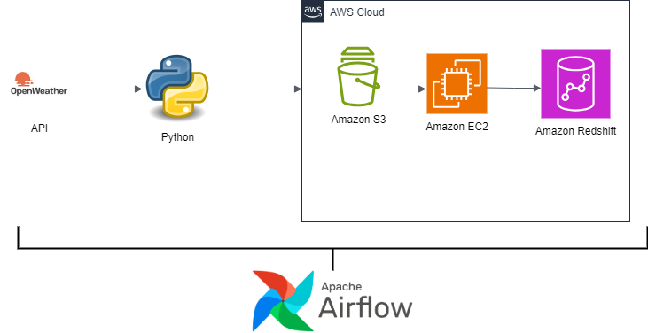

**AWS-Weather-ETL-Pipeline- Data Engineering Project**
--------------------------------

## Overview
----------------------
This project is a data engineering pipeline implemented using Apache Airflow on Amazon Web Services (AWS) for processing OpenWeather data. The pipeline involves extracting weather data from the OpenWeather API, transforming it, and loading it into a data warehouse for analysis and visualization.
To display the diagram saved as a PNG file in your markdown, you can use the following syntax:

------------------

## Diagram Components

**1.OpenWeatherMap API:**

**Source:** This is the starting point where your data originates. The API provides weather data, which your pipeline will extract.

**2.AWS EC2 Instance:**

**Compute Resource:** An EC2 instance is launched to host your Apache Airflow setup. This instance is where the ETL process is orchestrated.

**3.Apache Airflow on EC2:**

**Orchestration Tool:** Airflow, running on the EC2 instance, is responsible for managing the workflow of the ETL pipeline. It schedules and coordinates tasks, ensuring that data is extracted, transformed, and loaded in the correct sequence.

**4.Data Extraction (Python Script):**

Airflow triggers a Python script that uses the OpenWeatherMap API to extract weather data. This script fetches the required data and stores it temporarily in S3 or directly on the EC2 instance.

**5.Data Loading (AWS Redshift):**
After transformation, the data is loaded into AWS Redshift. Redshift serves as your data warehouse, where the processed data is stored for querying and analysis.

This projects aims at automating the whole ETL process and the weather reports can be extracted on daily basis and furthur analysis can be drawn efficiently without any manual intervention. 

